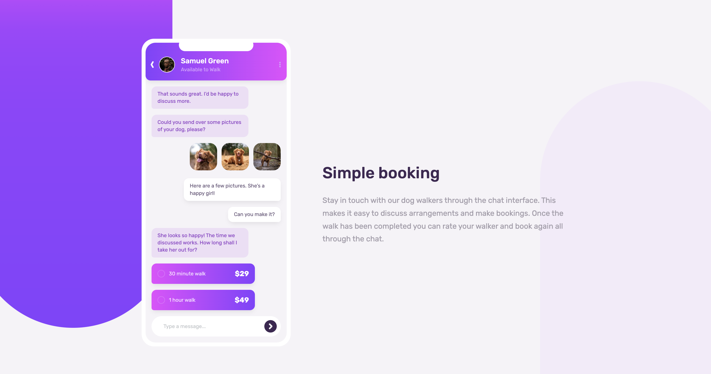

# Frontend Mentor - Chat app CSS illustration solution

This is a solution to the [Chat app CSS illustration challenge on Frontend Mentor](https://www.frontendmentor.io/challenges/chat-app-css-illustration-O5auMkFqY). Frontend Mentor challenges help you improve your coding skills by building realistic projects. 

## Table of contents

- [Overview](#overview)
  - [The challenge](#the-challenge)
  - [Screenshot](#screenshot)
  - [Links](#links)
- [My process](#my-process)
  - [Built with](#built-with)
  - [What I learned](#what-i-learned)
  - [Continued development](#continued-development)
  - [Useful resources](#useful-resources)
- [Author](#author)

## Overview

### The challenge

Users should be able to:

- View the optimal layout for the component depending on their device's screen size
- **Bonus**: See the chat interface animate on the initial load

### Screenshot

### Links

- [Solution URL](https://www.frontendmentor.io/solutions/pure-htmlcss-with-flexbox-and-media-queries-SJF4mzCrc)
- [Live site URL](https://skyebrownh.github.io/chat-app-css-illustration/)

## My process

### Built with

- Semantic HTML5 markup
- CSS custom properties
- Flexbox
- Mobile-first workflow

### What I learned

This challenge was great for practicing more complex CSS by creating illustrations and icons. I feel more confident in my ability to to do this in the future.

### Continued development

I didn't get around to building the bonus feature of animating the chat illustration on page load. If I revisit this project in the future, I plan on completing this as well.

### Useful resources

- [box-shadow.dev](https://box-shadow.dev/) - The only way I make box shadows look good.

## Author

- Frontend Mentor - [@skyebrownh](https://www.frontendmentor.io/profile/skyebrownh)
- Twitter - [@skyebrownh](https://twitter.com/skyebrownh)
- GitHub - [@skyebrownh](https://github.com/skyebrownh)
